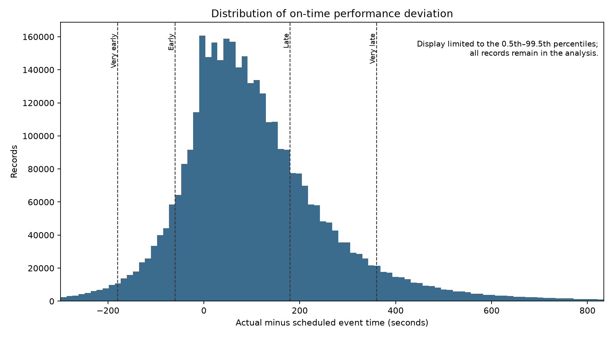
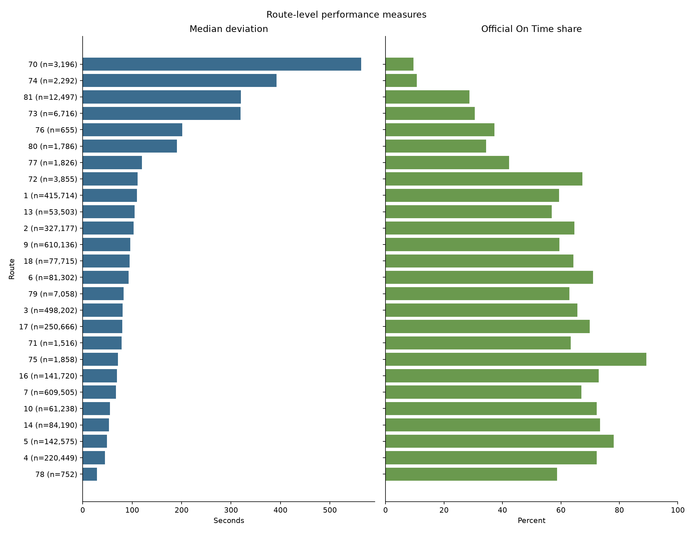
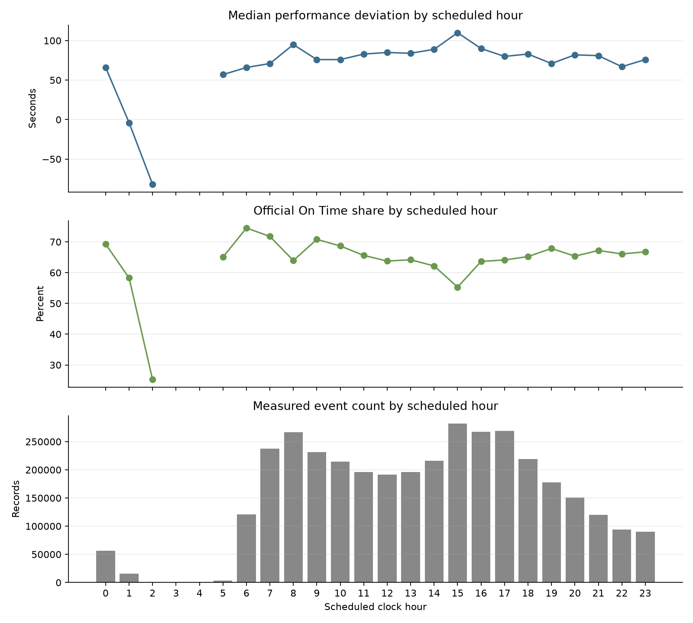
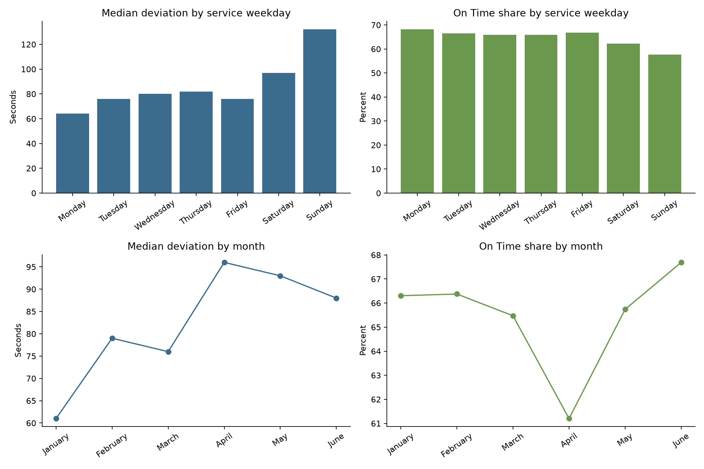
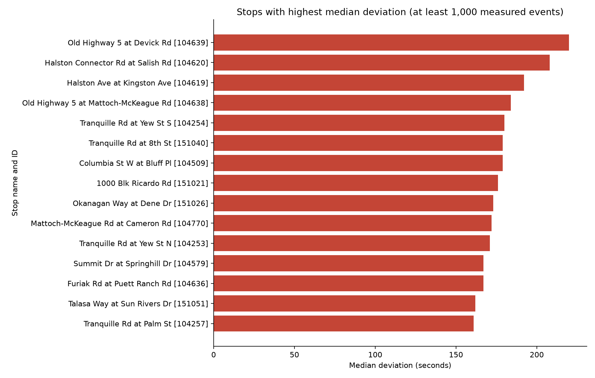

# Exploratory Delay Analysis

## Scope and method

This analysis describes stop-level transit events recorded from January 1 through June 30, 2026. The primary delay measure is `on_time_performance_deviation_seconds`, because it is available for both arrival and departure events. Positive values indicate late operation and negative values indicate early operation.

Service status follows the categories supplied in the source data:

- Very Early: 180 seconds early or more
- Early: 60 to 179 seconds early
- On Time: from 59 seconds early through 180 seconds late
- Late: 181 to 360 seconds late
- Very Late: 361 seconds late or more

The analysis uses the supplied service date and clock values without timezone conversion. Records after midnight remain assigned to their supplied service date. Route- and stop-level summaries describe associations in this dataset; they do not establish that a route or stop caused a delay.

## System-wide results

Of 3,621,203 cleaned records, 3,618,099 contain the primary performance measurement. The median deviation is 82 seconds late, the mean is 107.5 seconds late, the 90th percentile is 303 seconds late, and the 95th percentile is 405 seconds late.

| Service status | Records | Share |
|---|---:|---:|
| Very Early | 71,658 | 1.981% |
| Early | 278,416 | 7.695% |
| On Time | 2,368,167 | 65.453% |
| Late | 657,784 | 18.180% |
| Very Late | 242,074 | 6.691% |

Overall, 9.676% of measured events are early, 65.453% are on time, and 24.871% are late. The mean exceeds the median and the upper tail extends well beyond the on-time window, showing a right-skewed delay distribution.



## Route patterns

Route performance varies substantially. Route 70 has the highest median delay at 563 seconds, but its result is based on only 3,196 records. Route 74 also has a high median delay of 392 seconds from 2,292 records. These smaller samples should not be compared directly with the busiest routes without qualification.

Among routes with at least 10,000 measured events, Route 81 has the highest median delay at 320 seconds and the lowest on-time share at 28.655%. Route 4 has the lowest median delay at 45 seconds, while Route 5 has the highest on-time share at 78.054% and a median delay of 49 seconds.



## Time patterns

The strongest daytime deterioration appears at 15:00. This hour contains 281,897 measured events, has a median delay of 110 seconds, an on-time share of 55.280%, and a late share of 34.382%. By comparison, 06:00 has a median delay of 66 seconds and an on-time share of 74.508% across 120,653 events.

Hours 03:00 and 04:00 have no scheduled events in the data. Hour 02:00 contains only 452 records, so its estimates are not representative of normal service volumes.



Weekend performance is weaker than weekday performance. Weekend events have a median delay of 111 seconds and a late share of 32.440%, compared with 75 seconds and 23.075% on weekdays. Sunday has the highest weekday median at 132 seconds and the largest late share at 37.425%; Monday has the lowest median at 64 seconds.

April has the weakest monthly result, with a median delay of 96 seconds, a 61.203% on-time share, and a 29.578% late share. January has the lowest monthly median at 61 seconds, while June has the highest on-time share at 67.690%. These monthly differences may reflect changes in traffic, weather, scheduling, route mix, or other conditions not yet represented in the data.



## Event and stop patterns

Arrival and departure events have different distributions. Arrivals have a median deviation of -4 seconds across 147,464 records, whereas departures have a median of 84 seconds across 3,470,635 records. The source `trip_id` field is constant, so arrival and departure records cannot be reliably paired within trips.

For stop comparisons, a minimum of 1,000 measured events is required. Under that threshold rule, Old Highway 5 at Devick Road has the highest median delay at 220 seconds across 1,706 records. Halston Connector at Salish follows at 208 seconds across 1,528 records. These values can be influenced by the routes and service periods represented at each stop, so they should be treated as descriptive signals rather than causal effects.



## Reproducibility

Run the analysis after creating the cleaned dataset:

```bash
python src/run_eda.py
```

The script regenerates the ten CSV summaries in `outputs/tables/` and six figures in `outputs/figures/`. The executable notebook `notebooks/02_eda.ipynb` presents the analysis as a sequence of questions, methods, results, and interpretations.

## Limitations carried forward

- The analysis covers six months, so it does not establish a full annual seasonal pattern.
- The operational timezone is not documented in the source delivery.
- The constant `trip_id` prevents trip-level sequencing and direct arrival-departure pairing.
- Route and stop summaries may reflect schedule design, service mix, traffic, weather, and passenger activity not included in the source fields.
- Exploratory comparisons are descriptive and should guide later modelling rather than be interpreted as causal findings.
