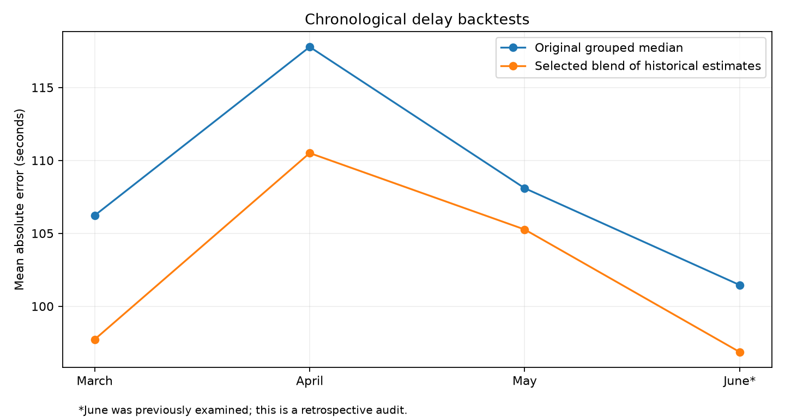

# Iterative delay-pattern backtesting

This extension studies whether recurring schedule patterns can improve departure-delay estimates across several successive months. It preserves the original regression experiment and uses new output files for the development search.

## Evaluation design

The development periods are March, April, and May 2026, with equal weight assigned to each month's mean absolute error. Each fit uses earlier service dates and leaves a two-service-day gap before prediction. This conservative gap protects against after-midnight observations crossing a training boundary; it is not evidence that actual data publication latency was two days.

June has already been inspected in the original experiment. Its new scores are retrospective audits, not independent final confirmation. Comparing many candidates on development months can also overfit those periods. Additional observations are needed to confirm future performance.

The first cycle compares the original hourly historical median with 30-minute, 15-minute, and exact scheduled-minute groups; 28- and 56-day history windows; and weekday/Saturday/Sunday grouping. The second cycle tests weekly refitting of the first cycle's selected pattern. The third cycle tests a small gradient-boosting correction to historical predictions. The fourth cycle tests five fixed blend weights between the correction model and the original monthly grouped median.

For the correction model, historical input estimates are generated separately for each week using only earlier observations. A row's own outcome never enters its historical predictor. Model fitting uses at most 500,000 earlier rows with a fixed random sample seed. Two fixed tree-complexity settings are compared using MAE. Neither setting is selected using June.

Candidate acceptance is initially screened for a mean improvement of at least 5% over the original grouped baseline and improvement in every development month. This is a provisional research criterion, not a passenger-service accuracy guarantee. Absolute error, the proportion of estimates within two minutes, route-level performance, and uncertainty remain necessary to interpret usefulness.

## Reproduction

```bash
python src/improve_delay.py
python src/boost_delay_patterns.py
python src/audit_delay_patterns.py
python src/test_delay_patterns.py
```

The scripts write compact comparisons under `outputs/tables/pattern_*`. Row-level backtests, historical tables, and fitted artifacts remain local under `data/processed/pattern_backtest/`. Existing regression artifacts are preserved.

## Results

The retained estimator blends 75% of a corrected historical prediction with 25% of the original grouped median. The correction uses absolute-error gradient boosting with 15 leaves, 140 iterations, learning rate 0.08, minimum leaf size 100, and L2 regularization 10. Historical features comprise hourly, exact-minute, and day-type medians, group size, fallback depth, route, direction, weekday, scheduled minute, and stop sequence. The model predicts the residual from the exact-minute median. All historical estimates are fitted before the prediction week.

| Evaluation month | Original monthly baseline MAE | Weekly baseline control MAE | Retained estimate MAE |
|---|---:|---:|---:|
| March | 106.23 s | 105.28 s | 97.73 s |
| April | 117.78 s | 116.25 s | 110.51 s |
| May | 108.10 s | 106.66 s | 105.27 s |
| June, retrospective | 101.46 s | 100.37 s | 96.86 s |

Equal-month development MAE falls from 110.70 to 104.50 seconds, a 5.60% improvement against the original monthly baseline. The selected estimate also improves on the weekly baseline in all three development months. Part of the gain over monthly fitting comes from updating historical information; the weekly control distinguishes that benefit from changes to the estimator.

The June retrospective audit contains 573,632 records, with RMSE 142.41 seconds, 73.04% of estimates within two minutes, and a 90th-percentile absolute error of 208.32 seconds. The blend was retained because of its development score even though the unblended correction has a slightly lower June MAE (96.63 seconds). June was not used to choose that weight.

The two-day gap makes the baseline here slightly different from the original Stage 8 experiment. All comparisons within this table use the same gap. Weekly updates can use observations from earlier weeks of the evaluation month; they cannot use current-week outcomes. These results describe rolling deployment with updates, not a forecast of the entire month from its first day.

## Pattern stability and practical limits

Routes 4 and 5 each met a development-only screen in every month: at least 1,000 observations, MAE no greater than 90 seconds, and at least 75% of predictions within two minutes. Their frozen June subset contains 58,127 records, with MAE 77.33 seconds and 80.92% within two minutes. This subset represents 10.13% of June observations; it is not a network-wide accuracy claim.

The afternoon remains harder to predict: development MAE around scheduled hour 15 is 134.58 seconds, compared with 86.15 seconds at hour 6. Sunday MAE is 125.51 seconds versus 96.59 seconds on Monday. These are descriptive error patterns, not causal explanations. Route 81 still has a June MAE of 266.75 seconds and only 27.22% of predictions within two minutes. The remaining weak groups should be visible alongside the stronger ones.

Compared with the monthly baseline, the retained estimator improves daily MAE on 31/31 March days, 29/30 April days, 27/31 May days, and 30/30 June days. Resampling whole days gives a June 95% bootstrap range of approximately 3.91–5.42 seconds for the mean MAE gain. This is descriptive uncertainty conditional on the selected model: it does not correct for the development search, dependence across neighbouring days, or future distribution changes.



## Individual estimates

After generating the local artifacts, `python src/predict_delay_pattern.py --help` describes the command for a single departure. It requires service date, route, stop, stop sequence, scheduled service-day minute, and optional direction. It returns a numerical estimate, historical group size, and fallback depth. Missing or unseen categories use supported fallbacks. After-midnight times retain minutes greater than 1,439.

The saved correction was fitted on observations before May 30. The command refuses earlier dates, and it refuses requests more than 14 days after the latest available operational date as a conservative freshness check. It uses the same weekly and monthly history cutoffs as the backtest. A direct prediction was checked against its stored backtest estimate.

This extension uses only the supplied BC Transit operational records. It does not use GTFS, external weather data, or real-time vehicle observations. The four development cycles produce an improved research estimator and identify useful route patterns, but do not establish readiness for live passenger guidance. Independent confirmation requires later operational outcomes.
