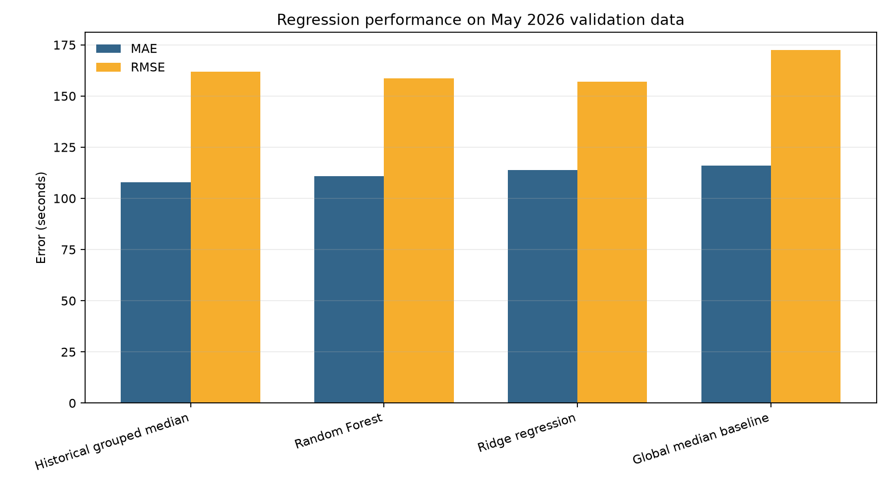
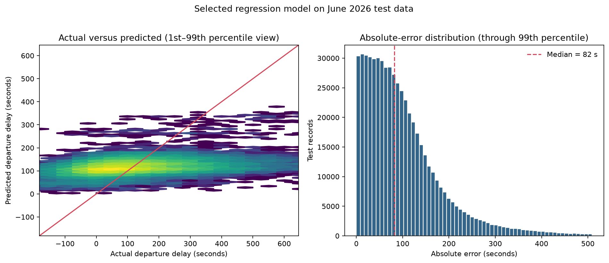

# Departure-Delay Regression Results

## Research question

How accurately can route, stop, and scheduled service information predict departure delay on later observations?

The primary evaluation metric is mean absolute error (MAE), measured in seconds. MAE represents the average absolute distance between a prediction and the recorded departure delay. Root mean squared error (RMSE) is also reported because it places greater weight on large errors, while R² describes the proportion of outcome variation represented by a method relative to predicting the mean.

## Validation comparison

Models were trained on January–April records and evaluated on 573,555 May records. No hyperparameter search was conducted.

| Method | MAE (seconds) | RMSE (seconds) | R² |
|---|---:|---:|---:|
| Global median baseline | 115.96 | 172.51 | -0.072 |
| Historical grouped median | **107.78** | 161.78 | 0.057 |
| Ridge regression | 113.88 | **156.99** | **0.112** |
| Random Forest | 110.98 | 158.52 | 0.095 |

Random Forest had the lowest MAE among the two machine-learning candidates and was therefore selected before the test set was examined. The historical grouped median nevertheless achieved the lowest validation MAE overall. Ridge regression produced the lowest validation RMSE and highest R², illustrating that model rankings depend on how errors are weighted.

## Held-out test results

After validation selection, Random Forest was refitted on January–May and evaluated once on 573,632 June records. Both baselines were updated using the same January–May development period.

| Method | MAE (seconds) | RMSE (seconds) | R² |
|---|---:|---:|---:|
| Global median baseline | 109.32 | 159.60 | -0.044 |
| Historical grouped median | **101.33** | **148.95** | **0.091** |
| Random Forest | 106.33 | 149.00 | 0.090 |

Random Forest reduced MAE by 2.99 seconds, or 2.733%, relative to the global median. The grouped median reduced MAE by 7.99 seconds, or 7.305%, and remained the most accurate method under the primary metric. The forest did not provide a meaningful improvement over this structured baseline.

The selected forest's median absolute test error is 82.12 seconds. The 90th percentile is 215.02 seconds, the 95th percentile is 287.51 seconds, and the 99th percentile is 509.13 seconds. Predictions are concentrated near typical delay values and do not reproduce the most extreme outcomes well.

## Historical grouped baseline behaviour

The grouped baseline uses the most specific historical group containing at least 30 development records, then falls back through broader groups. On June data, 71.771% of predictions use route, stop, weekday, and scheduled hour; 27.616% use route, stop, and hour; and 0.613% use broader route-stop or route summaries. No June prediction requires the global fallback.

This baseline is effective because it directly represents stable recurring combinations in the historical data. Its strong performance demonstrates why a machine-learning model should not be judged only against a single overall constant.

## Model interpretation

The Random Forest's encoded predictors were aggregated back to the seven original fields. Route accounts for 35.217% of impurity-based importance, followed by stop at 20.519% and service day of week at 14.597%. Month, stop sequence, direction, and scheduled time each account for smaller shares.

Impurity-based importance indicates how often and how effectively the fitted trees used a field. It does not show causation, and it can favour predictors that offer many possible split points or categories.

## Limitations

- The available predictors describe schedules and service structure but omit traffic, weather, passenger demand, incidents, and preceding vehicle conditions.
- R² values near 0.09 indicate that most event-level delay variation remains unexplained.
- Random Forest predictions tend toward common delay values and underrepresent extremes.
- The grouped baseline assumes that historical route-stop-time patterns remain reasonably stable.
- The study covers six months, limiting assessment of annual seasonality and longer-term operational change.
- The fixed candidate configurations provide a clear initial comparison but do not establish the best possible tuned performance.
